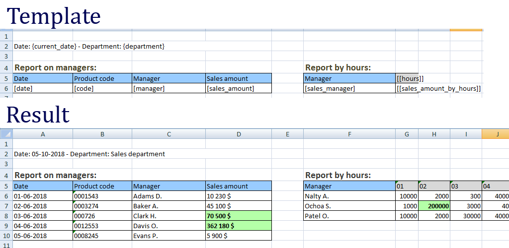
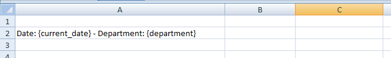
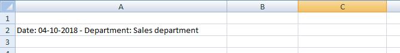
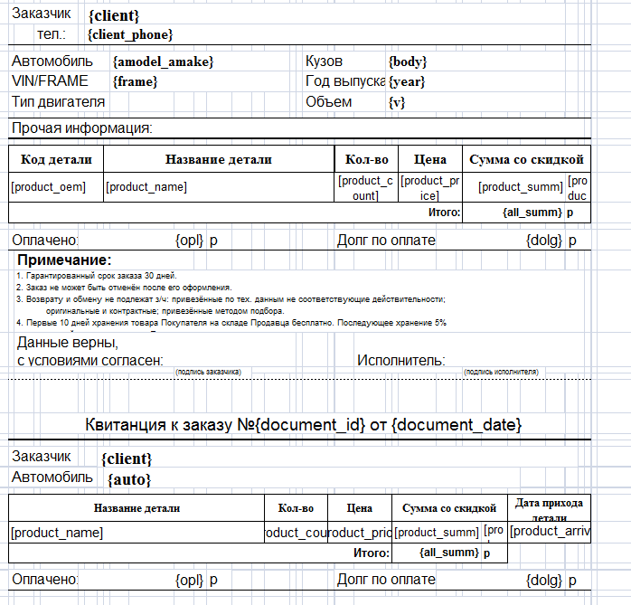

# PHP Excel Templator

[](https://packagist.org/packages/alhimik1986/php-excel-templator)
[](https://packagist.org/packages/alhimik1986/php-excel-templator)
[](https://packagist.org/packages/alhimik1986/php-excel-templator)
[](https://packagist.org/packages/alhimik1986/php-excel-templator)
[](https://packagist.org/packages/alhimik1986/php-excel-templator)
[](https://packagist.org/packages/alhimik1986/php-excel-templator)

[Инструкция на русском языке (Russian)](README_ru.md)

It's PHP Spreadsheet extension that allows you to export excel files from an excel template.
Using the extension you don’t need to create excel files from scratch using code, set styles and so on.

Demo screenshot:




## Simple example
There is a simplest example of how this might look (using less code).
Suppose we have an excel file with the following template variables:



The code will be as follows:
```
use alhimik1986\PhpExcelTemplator\PhpExcelTemplator;
require_once('vendor/autoload.php'); // if you don't use framework

PhpExcelTemplator::saveToFile('./template.xlsx', './exported_file.xlsx', [
	'{current_date}' => date('d-m-Y'),
	'{department}' => 'Sales department',
]);
```
As a result, we get:



Using this extension, we just create a template file with the styles we need and specify template variables in it. In the code, we just pass the parameters to template variables.

## Features
- We can insert several template variables in one table cell (if the data type is "string")
- We can insert a one-dimensional array, in this case additional rows will be created in the table
- We can insert a two-dimensional array, in this case the respective columns and rows are created in the table
- By specifying the value in the cells, you can change the styles of these cells, even when inserting arrays
- We can apply the same template on several sheets of the table

Features demo and usage examples are given in the folder "samples".

## Restrictions:
- Possible so-called side effects when using one-dimensional or two-dimensional arrays  in one sheet. Especially when it is located asymmetrically. An example of side effects is also given in the folder "samples".

## INSTALLATION:

```
$ composer require alhimik1986/php-excel-templator
```

### Template variable naming rules
The rules can be any, but I can offer my recommendation for naming template variables:
- {var_name} - for string values
- [var_name] - for one-dimensional arrays
- [[var_name]] - for two-dimensional arrays


### How to insert a one-dimensional array, so that the table create columns, not rows?
To do this, instead of a one-dimensional array, insert a two-dimensional one as follows:
```
$param['[[var_name]]'] = [['text 1', 'text 2', 'text 3']];
```

## Using setters
In the example above, the minimum code without setters was used.
The data types (for example: a string, a one-dimensional array, or a two-dimensional array) in this code is automatically recognized and the necessary setter is chose.
But if we want to use a specific setter, the same code will look like this:
```
use alhimik1986\PhpExcelTemplator\PhpExcelTemplator;
use alhimik1986\PhpExcelTemplator\params\ExcelParam;
use alhimik1986\PhpExcelTemplator\params\CallbackParam;
use alhimik1986\PhpExcelTemplator\setters\CellSetterStringValue;

require_once('vendor/autoload.php'); // if you don't use framework

$params = [
	'{current_date}' => new ExcelParam(CellSetterStringValue::class, date('d-m-Y')),
	'{department}' => new ExcelParam(CellSetterStringValue::class, 'Sales department'),
];
PhpExcelTemplator::saveToFile('./template.xlsx', './exported_file.xlsx', $params);
```
At the moment the extension has 3 kinds of setters:
- CellSetterStringValue (for string values)
- CellSetterArrayValue (for one-dimensional arrays)
- CellSetterArray2DValue (for two-dimensional arrays)

You ask, what for specify setters explicitly?
- First, because it's flexible: let's say you want to create your own setter with your own algorithms that eliminate the side effects, which I mentioned above.
- Secondly, in each setter, you can pass a callback function in which we can change the styles of the inserted cells. For example, you need to highlight with bold font the employees who made the best sales in this month.

Examples of code that uses all kinds of setters are listed in the folder "samples".

## How to set styles without setters?
In most cases to use the setters explicitly is not so convenient. I suppose you want to use minimum code. Therefore, I made it possible to set styles without using setters:
```
use alhimik1986\PhpExcelTemplator\PhpExcelTemplator;
use alhimik1986\PhpExcelTemplator\params\CallbackParam;
require_once('vendor/autoload.php'); // if you don't use framework

$params = [
	'{current_date}' => date('d-m-Y'),
	'{department}' => 'Sales department',
	'[sales_amount]' => [
		'10230',
		'45100',
		'70500',
	],
];

$callbacks = [
	'[sales_amount]' => function(CallbackParam $param) {
		$amount = $param->param[$param->row_index];
		if ($amount > 50000) {
			$cell_coordinate = $param->coordinate;
			$param->sheet->getStyle($cell_coordinate)->getFont()->setBold(true);
		}
	},
];

PhpExcelTemplator::saveToFile('./template.xlsx', './exported_file.xlsx', $params, $callbacks);
```

## Special setter for special templates (CellSetterArrayValueSpecial)

There are special templates, which require to insert the whole row, and not insert cell with shifting down. Moreover, it's required to merge cells, as well as the cell in which there was a template variable.




For these templates, a special setter has been created: CellSetterArrayValueSpecial. Examples of code that uses it is given in folder: samples/8_special_template.


## Events

The following are possible events and an explanation of why they can be applied:
```php
$events = [
    PhpExcelTemplator::BEFORE_INSERT_PARAMS => function(Worksheet $sheet, array $templateVarsArr) {
        // fires before inserting values into template variables        
    },
    PhpExcelTemplator::AFTER_INSERT_PARAMS => function(Worksheet $sheet, array $templateVarsArr) {
        // fires after inserting values into template variables.
        // It is used if you want to insert values​into a spreadsheet after columns and rows have been created. 
        // For example, when inserting an array of images.
        // If you insert images using $callbacks, then the images can shift to the right due to the fact that on the next line the template variable can create additional columns.
        // See an example: samples/10_images        
    },
    PhpExcelTemplator::BEFORE_SAVE => function(Spreadsheet $spreadsheet, IWriter $writer) {
        // fires before saving to a file. It is used when you need to modify the $writer or $spreadsheet object before saving, for example, $writer->setPreCalculateFormulas(false);        
    },
];
$callbacks = [];
$templateFile = './template.xlsx';
$fileName = './exported_file.xlsx';
$params = [
	// ...
];

PhpExcelTemplator::saveToFile($templateFile, $fileName, $params, $callbacks, $events);
```
