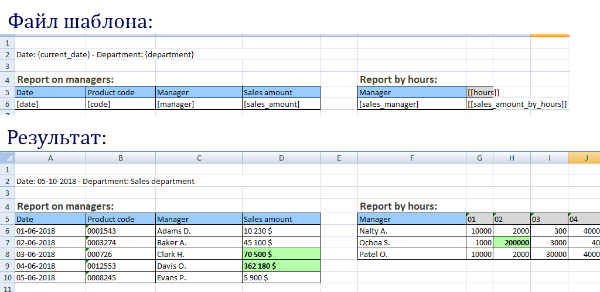

# PHP Excel Templator

[](https://packagist.org/packages/alhimik1986/php-excel-templator)
[](https://packagist.org/packages/alhimik1986/php-excel-templator)
[](https://packagist.org/packages/alhimik1986/php-excel-templator)
[](https://packagist.org/packages/alhimik1986/php-excel-templator)
[](https://packagist.org/packages/alhimik1986/php-excel-templator)
[](https://packagist.org/packages/alhimik1986/php-excel-templator)

PHP Excel модуль, позволяющий экспортировать excel-файлы из excel-шаблона.
Теперь не нужно при помощи кода с нуля создавать excel-файлы, прописывать в нём стили и т. д.

Демонстрация:



## Простой пример
Самый простой пример, как это может выглядеть (с минимальным количеством кода):
Допустим, у нас есть excel-файл со следующими шаблонными переменными:


Код будет выглядеть следующим образом:
```
use alhimik1986\PhpExcelTemplator\PhpExcelTemplator;
require_once('vendor/autoload.php'); // если используется чистый код без фреймворка

PhpExcelTemplator::saveToFile('./template.xlsx', './exported_file.xlsx', [
	'{current_date}' => date('d-m-Y'),
	'{department}' => 'Sales department',
]);
```
В результате мы получим:


С помощью этого модуля мы просто создаём файл шаблона с нужными нам стилями, указываем в нём шаблонные переменные. А в коде мы лишь передаём параметры, в которых указываем какое значение поместить в указанную шаблонную переменную.

## Характеристики
- Возможность вставить несколько шаблонных переменных в одной ячейке таблицы (если тип данных "строка")
- Возможность вставить одномерный массив, в этом случае в таблице будут создаваться дополнительные строки
- Возможность вставлять двумерный массив, в этом случае в таблице создаются соответствующие колонки и строки
- Всталяя значение в ячейки можно менять и стили этих ячеек, даже при вставке массивов
- Возможность применять один и тот же шаблон на нескольких листах таблицы

Демонстрация характеристик и примеры использования приведены в папке samples.

## Ограничения:
- Возможны так называемые побочные эффекты при использовании нескольких одномерных или двумерных массивов, чередующихся в определенных местах. Пример побочных эффектов также приведён в папке samples.

## УСТАНОВКА:

```
$ composer require alhimik1986/php-excel-templator
```

### Правила именования шаблонных переменных
Правила могут быть любыми, но я могу предложить свою рекомендацию по именованию шаблонных переменных:
- {var_name} - для строковых значений
- [var_name] - для одномерных массивов
- [[var_name]] - для двумерных массивов


### Как вставить одномерный массив, чтобы в таблице создавались не строки, а столбцы?
Для этого вместо одномерного массива вставляем двумерный следующим образом:
```
$param['[[var_name]]'] = [['text 1', 'text 2', 'text 3']];
```

## Испрользование сеттеров
В примере выше использовался минимальный код без сеттеров.
В нём тип данных (например: строка, одномерный массив или двумерный массив) распознаётся автоматически и подставляется нужный сеттер.
Но если мы хотим использовать определённый сеттер, тогда тот же самый код будет выглядеть следующим образом:
```
use alhimik1986\PhpExcelTemplator\PhpExcelTemplator;
use alhimik1986\PhpExcelTemplator\params\ExcelParam;
use alhimik1986\PhpExcelTemplator\params\CallbackParam;
use alhimik1986\PhpExcelTemplator\setters\CellSetterStringValue;

require_once('vendor/autoload.php'); // если используется чистый код без фреймворка

$params = [
	'{current_date}' => new ExcelParam(CellSetterStringValue::class, date('d-m-Y')),
	'{department}' => new ExcelParam(CellSetterStringValue::class, 'Sales department'),
];
PhpExcelTemplator::saveToFile('./template.xlsx', './exported_file.xlsx', $params);
```
На данный момент существует 3 вида сеттеров:
- CellSetterStringValue (для строчных значений)
- CellSetterArrayValue (для одномерных массивов)
- CellSetterArray2DValue (для двумерных массивов)

Вы спросите, для чего указывать сеттеры явно?
Во-первых, для гибкости: вдруг вы захотите создать собственный сеттер со своими алгоритмами, которые устраняют упоминаемые мной побочные эффекты.
Во-вторых, в каждом сеттере можно передавать функцию обратного вызова, в которой мы можем менять стили вставляемых ячеек. Например, нужно отметить жирным шрифтом сотрудников, которые отличились в этом месяце.

Примеры кода, в котором используются все виды сеттеров, приведены папке samples.

## Как задать стили без использования сеттеров?
В большинстве случаев задавать сеттеры явно - не так удобно. Хочется использовать минимум кода. Поэтому есть возможность задать стили без использования сеттеров:
```
use alhimik1986\PhpExcelTemplator\PhpExcelTemplator;
use alhimik1986\PhpExcelTemplator\params\CallbackParam;
require_once('vendor/autoload.php'); // если используется чистый код без фреймворка

$params = [
	'{current_date}' => date('d-m-Y'),
	'{department}' => 'Sales department',
	'[sales_amount]' => [
		'10230',
		'45100',
		'70500',
	],
];

$callbacks = [
	'[sales_amount]' => function(CallbackParam $param) {
		$amount = $param->param[$param->row_index];
		if ($amount > 50000) {
			$cell_coordinate = $param->coordinate;
			$param->sheet->getStyle($cell_coordinate)->getFont()->setBold(true);
		}
	},
];

PhpExcelTemplator::saveToFile('./template.xlsx', './exported_file.xlsx', $params, $callbacks);
```

## Специальный сеттер для специального шаблона (CellSetterArrayValueSpecial)
Существуют такие особые шаблоны, в которых, вставляя одномерный массив, нужно именно вставлять полностью строку, а не вставлять ячейку со сдвигом вниз и, к тому же, делать объединение ячеек, так же как и в ячейке, в которой была шаблонная переменная.


Для таких шаблонов создан специальный сеттер: CellSetterArrayValueSpecial. Пример его использования приведён в папке: samples/8_special_template.


## Использование событий

Ниже я привёл перечень возможных событий и пояснения, для чего их можно применить:
```php
$events = [
    PhpExcelTemplator::BEFORE_INSERT_PARAMS => function(Worksheet $sheet, array $templateVarsArr) {
        // Возникает перед вставкой значений в шаблонные переменные
    },
    PhpExcelTemplator::AFTER_INSERT_PARAMS => function(Worksheet $sheet, array $templateVarsArr) {
        // Возникает после вставки значений в шаблонные переменные.
        // Применяется, если нужно что-нибудь вставить в таблицу после того, как были созданы колонки и строки.
        // Например, когда нужно вставить массив картинок.
        // Если вставить картинки, используя $callbacks, то картинки могут смещаться вправо, 
        // так как при вставке значений в шаблонные переменные, которые находятся ниже, могу создаваться дополнительные колонки.
        // Поэтому массив картинок лучше вставлять после того, как все дополнительные колонки был созданы.
        // Для этого используется это событие.
        // Пример его использования приведён в папке: samples/10_images        
    },
    PhpExcelTemplator::BEFORE_SAVE => function(Spreadsheet $spreadsheet, IWriter $writer) {
        // Возникает перед созданием excel-файла после вставки значений в шаблонные переменные.
        // Может использоваться, если нам нужно произвести манипуляции с объектом $writer или $spreadsheet.
        // Например: $writer->setPreCalculateFormulas(false);  
       
    },
];
$callbacks = [];
$templateFile = './template.xlsx';
$fileName = './exported_file.xlsx';
$params = [
	// ...
];

PhpExcelTemplator::saveToFile($templateFile, $fileName, $params, $callbacks, $events);
```